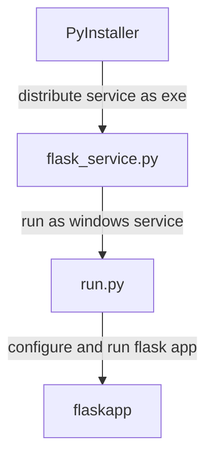

# 使用PyInstaller和Windows Service 发布Flask或Python项目

本文以Flask为例，介绍如何使用PyWin32将Python项目作为Windows Service运行，并使用PyInstaller将Python项目打包成二进制文件发布。

## Python环境

1. 创建虚拟环境

   ```shell
   conda create -n flask_service python=3.7
   ```

   使用虚拟环境可能会出现PyInstaller无法找到部分包的情况，如果不是很熟练，建议使用系统Python环境

2. 安装依赖

   ```shell
   pip install flask flask_restful pyinstaller pywin32
   ```

## 项目结构

文件目录如下

```c
+flask_service
│  flask_service.py    /* service启动 */
│  requirements.txt    /* dependencies */
│  run.py		       /* app启动 */
│  win_service.spec    /* PyInstaller配置 */
│
└─flaskapp             /* flask app */
   │  __init__.py
   │
   └─views             /* flask app 路由 */
      │  index.py
      └─ __init__.py

```

层级关系如下



首先需要创建一个`flask app`，使用`run.py`对`flask app`进行设置和调用，使用`flask_service.py`将python程序`run.py`封装成一个windows service服务，最后使用`PyInstaller`将服务打包成exe程序。

## Flask App

`Flask `项目设计可以参考[官方文档](https://flask.palletsprojects.com/en/1.1.x/tutorial/layout/)或者[典型案例](https://stackoverflow.com/a/37778716)。演示案例比较简单，只包含了`app`和`route`两部分，直接使用`flask_restful`来设置路由，存储在`view`目录下。

```
flaskapp
   │  __init__.py
   │
   └─views
      │  index.py
      └─ __init__.py
```

### flask app 初始化

```python
'''
flaskapp.__init__.py
'''

from flask import Flask
from flask_restful import Api
import logging

# set logger
logging.basicConfig(filename='C:\\Temp\\flask-service.log', level=logging.DEBUG,
                    format='%(asctime)s - %(name)s - %(levelname)s - %(message)s')

# create app
app = Flask(__name__)

# create api
api = Api(app)
```

### 路由

```python
'''
flaskapp.views.__init__.py
'''
from .index import Index

'''
flaskapp.views.index.py
'''

from flask_restful import Resource
from flaskapp import app, api

# create a rest Resource
class Index(Resource):
    def get(self):
        return 'hello world'

# add resource to route
api.add_resource(Index, '/')
```

需要注意的是，在案例的结构下，`from flaskapp import app`是不会加载路由的，必须先`from flaskapp import views`才会加载路由

### 启动Flask App

```python
'''
run.py
'''
# load app
from flaskapp import app
# load views
from flaskapp import views
# update config
app.config.update(**config_dict)
# run app
if __name__=="__main__":
	app.run(host='127.0.0.1', port='5001')
```

## Flask Service

使用`win32serviceutil.ServiceFramework`对`Flask App`进行封装，并实现`SvcStop`和`SvcDoRun`方法，实现方式如下

```python
'''
flask_service.py
'''
import win32serviceutil
import win32service
import win32event
import win32evtlogutil
import servicemanager
import socket
import time
import os
import sys

from run import app
import logging


class FlaskSvc(win32serviceutil.ServiceFramework):
    # service name
    _svc_name_ = "FlaskService"
    _svc_display_name_ = "Flask Service"

    def __init__(self, *args):
        win32serviceutil.ServiceFramework.__init__(self, *args)
        self.hWaitStop = win32event.CreateEvent(None, 0, 0, None)
        socket.setdefaulttimeout(5)
        self.stop_requested = False

    def SvcStop(self):
        self.ReportServiceStatus(win32service.SERVICE_STOP_PENDING)
        win32event.SetEvent(self.hWaitStop)
        self.ReportServiceStatus(win32service.SERVICE_STOPPED)
        logging.info('Stopped service ...')
        self.stop_requested = True

    def SvcDoRun(self):
        servicemanager.LogMsg(
            servicemanager.EVENTLOG_INFORMATION_TYPE,
            servicemanager.PYS_SERVICE_STARTED,
            (self._svc_name_, '')
        )
        logging.info('start service ...')
        self.main()

    def main(self):
        app.run(host=app.config.get('host', '0.0.0.0'),
                port=app.config.get('port', 5008))


if __name__ == '__main__':
    if len(sys.argv) == 1:
        servicemanager.Initialize()
        servicemanager.PrepareToHostSingle(FlaskSvc)
        servicemanager.StartServiceCtrlDispatcher()
    else:
        win32serviceutil.HandleCommandLine(FlaskSvc)

```

### Service 使用

Windows Service需要管理员权限操作，启动服务之前需要先安装

- 安装`Flask Service`

  ```shell
  python flask_service.py install
  ```

- 启动和停止`Flask Service`

  ```sehll
  python flask_service.py start
  python flask_service.py stop
  ```

- 调试

  ```shell
  python flask_service.py debug
  ```

- 卸载

  ```shell
  python flask_service.py remove
  ```

## Python Service

Python Service的运行机理不同于一般的python程序，它并非运行在Python Interpreter之下，而是在加载之后由`PythonService.exe`执行。这种情况下主要有两个问题。由于无法插入断点，Debug运行时异常将会变得困难，需要借助日志进行排查。另一个是运行时路径和环境变量会发生变化，无法使用相对路径来定位，这点会在之后详细说明。

在执行`python flask_service.py install/debug/start`时，可能会发现PyCharm的Debugger似乎仍然是可以抓到断点，但是这并非真正的运行状态。在`flask_service.py`执行到最后一行`win32serviceutil.HandleCommandLine(FlaskSvc)`，它仍然是一个运行在Python Interpreter内的脚本，因此在此之前仍然是可以抓到断点的。

但是到了`win32serviceutil.HandleCommandLine`内，从源码来看则是通过Windows Service调用`PythonService.exe`执行。

- **CASE**: `start`

```python

'''
    cmd: python flask_service.py start
    source: win32serviceutil.py #599
    win32serviceutil.HandleCommandLine
'''
    if arg=="start":
        knownArg = 1
        print("Starting service %s" % (serviceName))
        try:
            StartService(serviceName, args[1:]) # serviceName:FlaskService, args[1:]: start
            if waitSecs:
                WaitForServiceStatus(serviceName, win32service.SERVICE_RUNNING, waitSecs)
        except win32service.error as exc:
            print("Error starting service: %s" % exc.strerror)
            err = exc.winerror
```

启动服务的命令为`StartService(serviceName, args[1:]) # serviceName:FlaskService, args[1:]: start`

因为，Service已经被安装，`start`在这里直接通过Windows Service Manager来启动服务。

`Flask Service`在Windows Service Manager内注册的程序正好是`PythonService.exe`，而`PythonService.exe`定位到项目路径则是通过注册表实现。


- **CASE**:`debug`

```python
'''
    cmd: python flask_service.py debug
    source: win32serviceutil.py #617
    win32serviceutil.HandleCommandLine
'''
    elif arg=="debug":
        knownArg = 1
        if not hasattr(sys, "frozen"):
            # non-frozen services use pythonservice.exe which handles a
            # -debug option
            svcArgs = " ".join(args[1:])
            try:
                exeName = LocateSpecificServiceExe(serviceName)
            except win32api.error as exc:
                if exc.winerror == winerror.ERROR_FILE_NOT_FOUND:
                    print("The service does not appear to be installed.")
                    print("Please install the service before debugging it.")
                    sys.exit(1)
                raise
            try:
                # exeName:C:\\Personal\\MiniConda\\envs\\flask_service\\lib\\site-packages\\win32\\PythonService.exe
                os.system("%s -debug %s %s" % (exeName, serviceName, svcArgs))  # serviceName:FlaskService, svcArgs: debug
            # ^C is used to kill the debug service.  Sometimes Python also gets
            # interrupted - ignore it...
            except KeyboardInterrupt:
                pass
        else:
            # py2exe services don't use pythonservice - so we simulate
            # debugging here.
            DebugService(cls, args)
```

启动服务的命令为`os.system("%s -debug %s %s" % (exeName, serviceName, svcArgs))`由于ServiceManager不支持`debug`参数，所以这里直接通过命令行调用`PythonService.exe`传入了`debug`参数。

- **CASE**:`install`

1. 调用`win32serviceutil.InstallService`安装Service

   `serviceName:FlaskService`为服务名称

   `serviceClassString:C:\\Personal\\project\\flask_service\\flask_service.FlaskSvc`则指向了项目路径

```python
'''
    cmd: python flask_service.py install
    source: win32serviceutil.py #645
    win32serviceutil.HandleCommandLine
'''   
    if arg=="install":
        knownArg = 1
		'''
		*****ignore some code******
		'''
        try:
            # serviceClassString:C:\\Personal\\project\\flask_service\\flask_service.FlaskSvc
            InstallService(serviceClassString, serviceName, serviceDisplayName, serviceDeps = serviceDeps, startType=startup, bRunInteractive=interactive, userName=userName,password=password, exeName=exeName, perfMonIni=perfMonIni,perfMonDll=perfMonDll,exeArgs=exeArgs,
                           description=description, delayedstart=delayedstart)
            if customOptionHandler:

```

2. `win32service.CreateService`创建服务,并调用`InstallPythonClassString`

   `serviceName:FlaskService`为服务名称

   `commandLine:C:\\Personal\\MiniConda\\envs\\flask_service\\lib\\site-packages\\win32\\PythonService.exe`指向了服务运行路径

   向Windows Service Manager安装了服务

```python
                
'''
    cmd: python flask_service.py install
    source: win32serviceutil.py #134
    win32serviceutil.InstallService
'''                   
def InstallService(pythonClassString, serviceName, displayName, startType = None, errorControl = None, bRunInteractive = 0, serviceDeps = None, userName = None, password = None, exeName = None, perfMonIni = None, perfMonDll = None, exeArgs = None,
                   description = None, delayedstart = None):
'''
*************ignore some code************
'''
    hscm = win32service.OpenSCManager(None,None,win32service.SC_MANAGER_ALL_ACCESS)
    try:
        hs = win32service.CreateService(hscm,
                                serviceName,
                                displayName,
                                win32service.SERVICE_ALL_ACCESS,         # desired access
                    serviceType,        # service type
                    startType,
                    errorControl,       # error control type
                    commandLine,
                    None,
                    0,
                    serviceDeps,
                    userName,
                    password)
'''
************ignore some code***********
'''
    InstallPythonClassString(pythonClassString, serviceName)
    # If I have performance monitor info to install, do that.
    if perfMonIni is not None:
        InstallPerfmonForService(serviceName, perfMonIni, perfMonDll)

```

3. `win32service.InstallPythonClassString`绑定项目代码

   `pythonClassString:serviceClassString:C:\\Personal\\project\\flask_service\\flask_service.FlaskSvc`指向项目路径

   `serviceName:FlaskService`为服务名称

   通过注册表绑定了服务和项目代码

```python
'''
    cmd: python flask_service.py install
    source: win32serviceutil.py #252
    win32serviceutil.InstallPythonClassString
'''                   
def InstallPythonClassString(pythonClassString, serviceName):
    # Now setup our Python specific entries.
    if pythonClassString:
        key = win32api.RegCreateKey(win32con.HKEY_LOCAL_MACHINE, "System\\CurrentControlSet\\Services\\%s\\PythonClass" % serviceName)
        try:
            win32api.RegSetValue(key, None, win32con.REG_SZ, pythonClassString);
        finally:
            win32api.RegCloseKey(key)
```

## PyInstaller 发布

### 生成spec文件

可以直接使用`PyInstaller`打包

```shell
pyinstaller flask_service.py
```

程序运行结束后，会生成`flask_service.spec`文件、`build`和`dist`文件夹。

`PyInstaller`会自动加载项目依赖，然后进行编译和打包，但对于隐式的依赖关系，`PyInstaller`并不能处理，因此需要手动添加。

### 修改spec文件

将生成后的`flask_service.spec`复制并重命名为`local_service.spec`,重命名是为了防止运行`pyinstaller flask_service.py`后被覆盖，其内容大致如下

```python
# -*- mode: python ; coding: utf-8 -*-

block_cipher = None


a = Analysis(['flask_service.py'],
             pathex=['C:\\Personal\\project\\flask_service'],
             binaries=[],
             datas=[],
             hiddenimports=[],
             hookspath=[],
             runtime_hooks=[],
             excludes=[],
             win_no_prefer_redirects=False,
             win_private_assemblies=False,
             cipher=block_cipher,
             noarchive=False)
pyz = PYZ(a.pure, a.zipped_data,
             cipher=block_cipher)
exe = EXE(pyz,
          a.scripts,
          [],
          exclude_binaries=True,
          name='flask_service',
          debug=False,
          bootloader_ignore_signals=False,
          strip=False,
          upx=True,
          console=True )
coll = COLLECT(exe,
               a.binaries,
               a.zipfiles,
               a.datas,
               strip=False,
               upx=True,
               upx_exclude=[],
               name='flask_service')

```

修改`Analysis.pathex`字段，添加当前Python环境的`Lib\site-packages`目录

```Python
pathex=['C:\\Personal\\project\\flask_service','C:\\Personal\\MiniConda\\envs\\flask_service\\Lib\\site-packages']
```

修改`Analysis.datas`字段，添加需要的文件，例如`config.json`，`datas`格式为元组列表，传入文件的绝对路径和发布后的相对路径。相对路径`.`即编译之后的主路径，在默认情况下位于`dist\flask_service`

```
datas=[('C:\\Personal\\project\\flask_service\\custom_config.json','.')]
```

修改`Analysis.hiddenimports`，添加隐式的依赖，`flask`需要的依赖大致如下

```python
hiddenimports=['win32timezone',
                'altgraph',
                'Click'
                'Flask',
                'future',
                'itsdangerous',
                'flask_restful',
                'Jinja2',
                'macholib',
                'MarkupSafe',
                'pefile',
                'PyInstaller',
                'pyodbc',
                'pywin32',
                'pywin32-ctypes',
                'Werkzeug'
                ],
```

在引入了其他依赖时，如果在运行过程中出现缺少依赖的提示，一并添加即可。

### 编译发布

将修改后的`spec`使用`PyInstaller`编译发布即可。

```
python -m PyInstaller local_service.spec
```

发布生成目录在`dist\flask_service`，将该目录复制拷贝到其他计算机运行即可。

### 服务管理

服务的管理需要计算机管理员权限，需要使用管理员启动命令行或者PyCharm

- 安装

  ```shell
  .\dist\flask_service\flask_service.exe install
  ```

- 启动

  ```
  .\dist\flask_service\flask_service.exe start
  ```

- 卸载

  ```
  .\dist\flask_service\flask_service.exe remove
  ```

还可以使用windows系统组件-服务来进行管理，并设置自动启动。


## 路径

在使用用户`config`文件时，不可避免的需要读取文件。在本项目中，出于不同层次的调试目的，会涉及到三种方式来启动`Flask App`。

1. 使用`run.py`启动

   ```shell
   python run.py
   ```

2. 使用`flask_service.py`作为服务，在`PythonService.exe`中启动

   ```shell
   python flask_service.py install
   python flask_service.py start
   ```

3. 使用`PyInstaller`编译之后启动

   ```
   python -m PyInstaller local.spec
   .\dist\flask_service\flask_service.exe install
   .\dist\flask_service\flask_service.exe start
   ```

由于程序的入口的不同，这三种方式启动后的工作目录也会不同，这会对目录文件的定位造成影响。

使用`os.path.abspath('.')`来获取相对地址，对应三种方式内的返回地址分别如下：

```python
"C:\\Personal\\project\\flask_service" # run.py
"C:\\Personal\\MiniConda\\envs\\ethylene_scheduling\\Lib\\site-packages\win32" # flask_service.py
"C:\\Windows\\System32"  # PyInstaller
```

`run.py`是一个普通python脚本方式运行，所以目录对应了脚本所在目录；`flask_service.py`是由`PythonService.exe`启动的，所以对应了`PythonService.exe`的目录；而`PyInstaller`编译后的文件作为系统服务启动，目录默认定位在`C:\Windows\System32`。

为了保证在不同场景下都能够获取到正确的相对目录，使用`inspect`来获取代码所在目录。

```python
import os
import inspect
os.path.dirname(inspect.currentframe().f_globals.get('__file__'))
```

需要注意的是，示例`inspect`获取的是当前代码文件所在的目录，即便目录编译后不显式存在。

在`run.py`插入示例代码，则返回目录分别如下

```python
"C:\\Personal\\project\\flask_service" # run.py
"C:\\Personal\\project\\flask_service" # flask_service.py
"C:\\Personal\\project\\dist\\flask_service"  # PyInstaller
```

而在`flaskapp\__init__.py`插入同样代码，则分别会返回	

```python
"C:\\Personal\\project\\flask_service\\flaskapp" # run.py
"C:\\Personal\\project\\flask_service\\flaskapp" # flask_service.py
"C:\\Personal\\project\\dist\\flask_service\\flaskapp"  # PyInstaller
```

但是经过PyInstaller编译之后，flaskapp目录已经不存在


所以在使用`inspect`定位相对目录时，最好使用项目根目录。